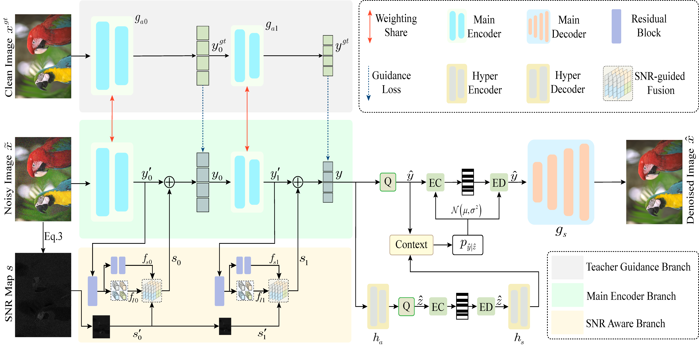

# Denoise Image Compression

**Official PyTorch Implementation for [Powerful Lossy Compression for Noisy Images (ICME 2024)](https://ieeexplore.ieee.org/document/10687468).**

> **Powerful Lossy Compression for Noisy Images** <br>
> Shilyu Cai, Xiaoguo Liang, Shuning Cao, Luxin Yan, Sheng Zhong, Lunqun Chen, Zou Xu <br>
> HUST <br>



## Introduction

Image compression and denoising represent fundamental challenges in image processing with many real-world applications. To address practical demands, current solutions can be categorized into two main strategies: 1) sequential method; and 2) joint method. However, sequential methods have the disadvantage of error accumulation as there is information loss between multiple individual models. Recently, the academic community began to make some attempts to tackle this problem through end-to-end joint methods. Most of them ignore that different regions of noisy images have different characteristics. To solve these problems, in this paper, our proposed signal-tonoise ratio (SNR) aware joint solution exploits local and non-local features for image compression and denoising simultaneously. We design an end-to-end trainable network, which includes the main encoder branch, the guidance branch, and the signal-to-noise ratio (SNR) aware branch. We conducted extensive experiments on both synthetic and real-world datasets, demonstrating that our joint solution outperforms existing state-of-the-art methods.

## Installation

This repository is developed based on a Linux machine with the following:

* Ubuntu 18.04.5 LTS
* NVIDIA-SMI 460.32.03
* Driver Version: 460.32.03
* CUDA Version: 11.2
* GPU: GeForce RTX 3090

Clone this repository and set up the environment.

```bash
cd Joint-IC-Denoising/CompressAI
conda create -n decomp python=3.8
conda activate DIC
pip install -U pip && pip install -e .
pip install pyyaml
pip install opencv-python
pip install tensorboard
pip install imagesize
pip install image_slicer
```

**Note**: For different optimization objectives, they need to be compiled and installed separately in different folders before they can be used properly. This means that the 'pip install - U pip&&pip install - e.' command needs to be executed multiple times. I originally intended to merge the projects together, but my time is limited. Please forgive me for any inconvenience I have caused you.

## Dataset Preparation

### 1. Synthetic Dataset

The Flicker 2W dataset (or your own data) is used for training and validation. You could download the dataset through this [link](https://drive.google.com/file/d/1EK04NO6o3zbcFv5G-vtPDEkPB1dWblEF/view), which is provided on their official [GitHub](https://github.com/liujiaheng/CompressionData) page. Place the unzipped dataset under the `./data` directory with the following structure:

```
.
`-- data
    |-- CLIC
    |-- flicker
    |   `-- flicker_2W_images
    |       |-- 1822067_f8836ff595_b.jpg
    |       |-- ...
    |       `-- 35660517375_a07980467e_b.jpg
    |-- kodak
    `-- SIDD   
```

Then run the following scripts to split the data into training and testing samples. The script also filters out the images with less than $256$ pixels as described in the paper.

```bash
cd codes/scripts
python flicker_process.py
```

### 2. Kodak Dataset

The Kodak PhotoCD image dataset (Kodak) dataset consists of 24 uncompressed PNG true-color images with resolution sizes of 768 $\times$ 512. Our models trained on the Flicker 2W dataset with synthetic noise are tested on Kodak images with synthetic noise at 4 different pre-determined levels. You could download the dataset on their offical [website](http://r0k.us/graphics/kodak/). Place the Kodak dataset under the `./data` directory with the following structure:

```
.
`-- data
    |-- CLIC
    |-- flicker
    |-- kodak
    |   |-- kodim01.png
    |   |-- ...
    |   `-- kodim24.png
    `-- SIDD   
```

### 3. CLIC Dataset

The CLIC Professional Validation (CLIC) dataset is the validation set of the 4th Workshop and Challenge on Learned Image Compression (2021), which contains 41 high-resolution (2K) images. Our models trained on the Flicker 2W dataset with synthetic noise are also tested on CLIC images with synthetic noise at the 4 different pre-determined levels. You could download the dataset on their CLIC 2021 offical [website](http://clic.compression.cc/2021/tasks/index.html). Place the CLIC dataset under the `./data` directory with the following structure:

```
.
`-- data
    |-- CLIC
    |   |-- alberto-montalesi-176097.png
    |   |-- ...
    |   `-- zugr-108.png
    |-- flicker
    |-- kodak
    `-- SIDD   
```

### 4. Real-world Dataset

We use the public [SIDD-Medium](https://www.eecs.yorku.ca/~kamel/sidd/dataset.php) dataset for training; we further validate and test on the [SIDD Benchmark](https://www.eecs.yorku.ca/~kamel/sidd/benchmark.php) data. Specifically, you need to download the followings:

* SIDD-Medium Dataset - sRGB images only (~12 GB)
* SIDD Benchmark - SIDD Benchmark Data - Noisy sRGB data
* SIDD Benchmark - SIDD Validation Data and Ground Truth - Noisy sRGB data
* SIDD Benchmark - SIDD Validation Data and Ground Truth - Ground-truth sRGB data
* SIDD Benchmark - SIDD Benchmark Data (full-frame images, 1.84 GB)

After you download all the data, place the unzipped dataset under the `./data` directory and organize them with the following structure:

```
.
`-- data
    |-- CLIC
    |-- flicker
    |-- kodak
    `-- SIDD  
        |-- SIDD_Benchmark_Data
        |-- SIDD_Benchmark_zips
        |   |-- BenchmarkNoisyBlocksSrgb.mat
        |   |-- ValidationGtBlocksSrgb.mat
        |   `-- ValidationNoisyBlocksSrgb.mat
        `-- SIDD_Medium_Srgb
```

Then run the following scripts to process the data and generate annotations.

```bash
cd codes/scripts
python sidd_block.py
python sidd_tile_annotations.py
```

## Training

To train a model, run the following script:

```bash
cd codes
OMP_NUM_THREADS=4 python train.py -opt ./conf/train/<xxx>.yml
```

## Testing

We provide our trained models in our paper for your reference. Download all the pretrained weights of our models from [Baidu Drive](https://pan.baidu.com/s/1vOZRHeRU5NJ3eyjQiZV6IA) (extraction code: 2a85). Unzip the zip file and place pretrained models under the `./experiments` directory.

To test a model, run the following script:

```bash
cd codes
OMP_NUM_THREADS=4 python test.py -opt ./conf/test/<xxx>.yml
```

## Acknowledgement

This repository is built based on [CompressAI](https://github.com/InterDigitalInc/CompressAI).

## Citation

If you find this work useful, please cite our paper:

```
@inproceedings{cai2024dic,
    title     = {Powerful Lossy Compression for Noisy Images}, 
    author    = {Cai, Shilyu and Liang, Xiaoguo and Cao, Shuning and Yan, Luxin and Zhong, Sheng and Chen, Liqun and Zou, Xu},
    booktitle = {Proceedings of the IEEE International Conference on Multimedia and Expo (ICME)},
    year      = {2024},
    pages     = {1-6}
}
```

## Contact

Feel free to open an issue if you have any question. You could also directly contact us through email at caishilv1024@gmail.com (Shilyu Cai).
